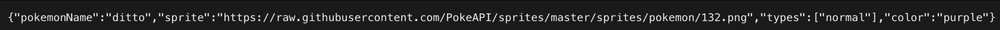

# Exercise 6 - Poké API

## Description
In this exercise, bootcampers will familiarize themselves with Next.js, API Endpoints, and Dynamic Routing.

## Submission
See the submission instructions down below.
- **Due Date**: TBD

## Instructions

We are going to start working with Next! So far we have mainly worked with frontend code, but what if we want to create our own system for storing/organizing data? We will do this by creating a backend using Next.js! 

First, you need to create a Next app. In your terminal, `cd` into exer6. Once you are there create a Next app by typing `npx create-next-app@latest`. You will be given a bunch of prompts: title the app to your preference (we are working with the Pokemon API), and follow the slides for the rest of the prompts.

### API ENDPOINTS

All API endpoints should exist in the `pages/api` folder of your Next.js project. This means all api routes will be prefixed with `/api` (helpful for testing).

```http
GET /
```
- returns the name, sprite, and type of random Pokemon

```http
GET /pokemon/:name
```
- returns the name, sprite, and type of a certain Pokemon

```http
GET /types/:type
```
- returns a list of Pokemon of this type

```http
GET /evolve/:name
```
- returns the next evolution step for a specified Pokemon. If the Pokemon is fully evolved, return the current evolution stage

```http
POST /battle
```
- Body of the request
	- `pokemon1` - the name of the first Pokemon to be battled (String)
	- `pokemon2` - the name of the second Pokemon to be battled (String)
- `pokemon1` and `pokemon2` are name strings sent in the **body** of the post request. Returns the pokemon with the higher base stat. 

### Tips
You can look at `hello.js` for a baseline for how to call and return from an endpoint.

Remember to set your status codes before returning: Inside your try/catch, if the data has successfully returned then set the code to `200`, if the data is invalid set it to `400`, and otherwise set the code to `500`.

Use `fetch` to call the Pokemon API and make sure to have two awaits within the async call: one for fetching from the URL, and another for converting the response to a JSON.

For the calls where we need to incorporate dynamic routing, the file should be titled with brackets, so that Next knows that it is a dynamic route.

To see your responses, use the browser or Postman, for example, `http://localhost:3000/api/pokemon/ditto` to get the Pokemon information for ditto.

You will end up having to make multiple calls to the PokeAPI for some of the GET requests.

**Requirements:**
- Create a Next App
- Only create folders/files within the api folder
- Complete all four endpoints and incorporate dynamic routing where needed
- Format the endpoints to account for invalid data or other issues with a try/catch and different return status codes
- Create a short video, maybe 0.5-1 minutes, showing that all your calls work through the browser or Postman and link it at the top of your ReadMe.

## Example Return for /pokemon/ditto


